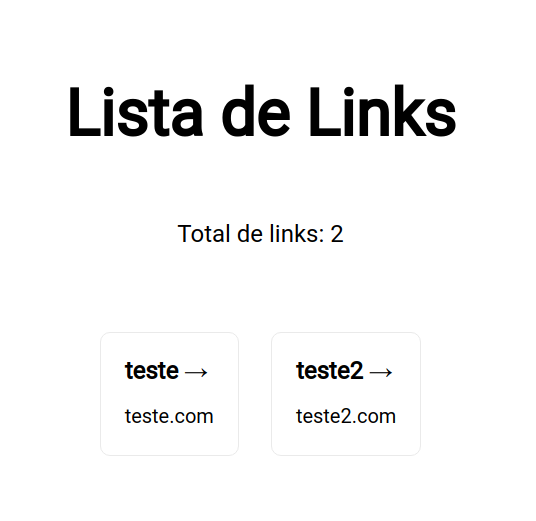

# Links ​

## 👀 Como ficou ???

</img>
----------

## 🧑‍💻 Tecnologias usadas

O projeto foi desenvolvido com as seguintes tecnologias:
- [TypeScript](https://www.typescriptlang.org/)
- [Next](https://pt-br.reactjs.org/)
- [Prisma](https://www.prisma.io/)
- [GraphQL](https://graphql.org/)

## ⌨️ Sobre o projeto

O projeto consiste numa lista de links. O mesmo foi desenvolvido durante o curso da [B7Web](https://b7web.com.br/fullstack/?ref=I24108426I) e com a ajuda do instrutor [Bonieky Lacerda](https://www.instagram.com/bonieky/).

## `npm install`

É necessário dar um "npm install" ou "npm i", para instalar as depêndencias do projeto.

## Rodar o projeto

Primeiramente é necessário ter o node, caso não tenha faça a instalação dele. [NODE](https://nodejs.org/en/download/);
Criar um banco de dados, colocar sua url no .env;
`npx prisma db push`;

## `npm run dev`

Depois de ter instalado as dependências, basta dar um "npm run dev", para rodar o projeto em modo desenvolvedor. Abra [http://localhost:3000](http://localhost:3000) para vê o projeto em seu navegador.
